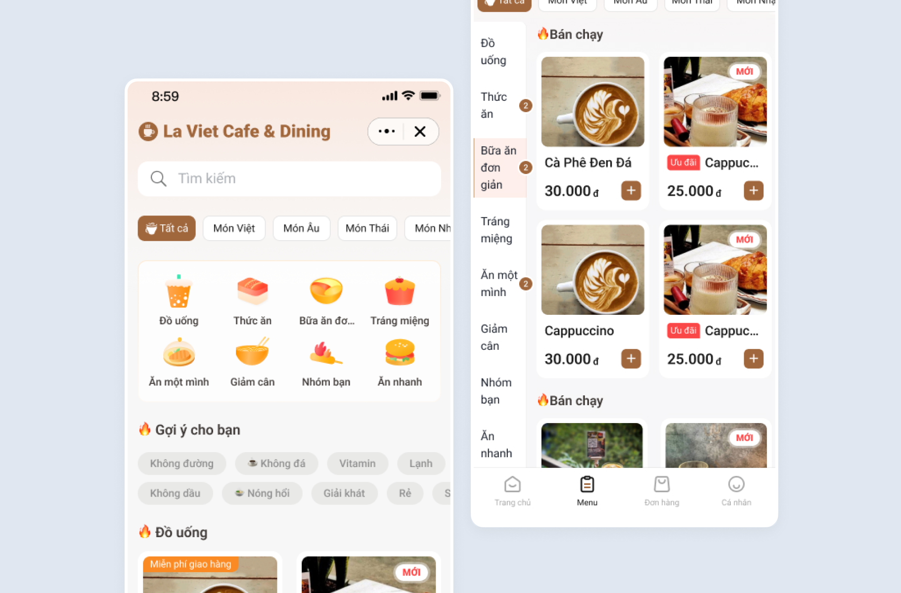
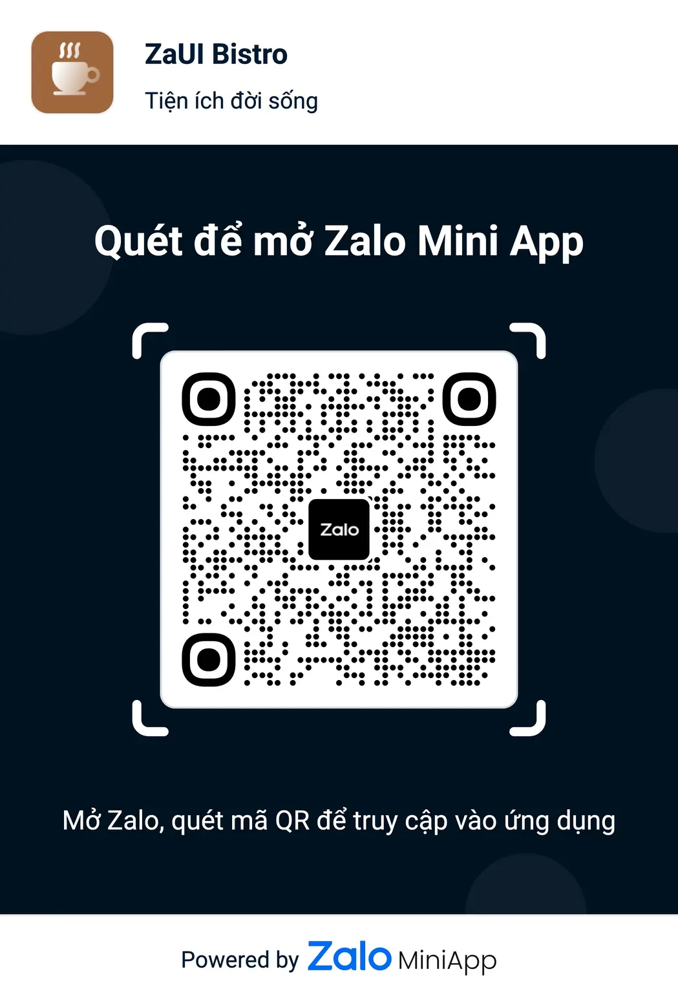

# ZaUI Bistro

ZaUI Bistro là bộ giao diện mẫu (Template) dành cho các ứng dụng đặt món (Coffee & Food) trên nền tảng Zalo Mini App, tập trung vào trải nghiệm người dùng mượt mà và hiện đại.

Template này cung cấp đầy đủ các tính năng từ duyệt menu đa tầng, tùy chọn món ăn chi tiết (topping, size), cho đến quy trình thanh toán và quản lý đơn hàng.

# Demo



# Figma

- Link Figma: https://www.figma.com/design/Byuy8djfHcsnxousDMFSqL/-Public--Zalo-Mini-App-Templates?node-id=9-16784

# QR Code

<div style="display: flex; justify-content: center;"
>
  
</div>

## Tính năng chính

- **Menu đa dạng**: Hỗ trợ danh mục nhiều cấp (Category & Subcategory).
- **Chi tiết món ăn**: Tùy chọn biến thể (Size, Mức đường/đá), Topping và số lượng.
- **Tìm kiếm & Bộ lọc**: Tìm kiếm nhanh, lọc theo tính năng và gợi ý món ngon (tags).
- **Quy trình đặt hàng**: Giỏ hàng, Thanh toán, Tùy chọn Giao hàng/Mang đi (Delivery/Pickup).
- **Quản lý cá nhân**: Lịch sử đơn hàng, Chi tiết đơn hàng và Hồ sơ thành viên.

## Tech stack

<p style="display: flex; flex-wrap: wrap; gap: 4px;">
  
  
  
  
  
  
  
  
  
</p>

Dự án sử dụng các công nghệ mới nhất:

- **Core**: React 18, ZMP SDK, ZMP UI.
- **Routing**: React Router v7.
- **State Management**: Zustand (Global state) & TanStack Query (Server state).
- **Styling**: TailwindCSS & Sass.
- **Build Tool**: Vite 5.x.

## Hướng dẫn cài đặt và sử dụng

### Sử dụng Zalo Mini App Extension

1. Cài đặt [Visual Studio Code](https://code.visualstudio.com/download) và [Zalo Mini App Extension](https://mini.zalo.me/docs/dev-tools).
2. Nhấp vào **Create Project** > Chọn template **ZaUI Bistro** > Đợi khởi tạo dự án.
3. Cấu hình **App ID** và **Install Dependencies**, sau đó vào bảng **Run** > chọn **Start** để bắt đầu phát triển 🚀

### Sử dụng Zalo Mini App CLI

1. [Cài đặt Node JS](https://nodejs.org/en/download/).
2. [Cài đặt Mini App DevTools CLI](https://mini.zalo.me/docs/dev-tools/cli/intro/).
3. Tải xuống hoặc clone repository này.
4. Cài đặt thư viện:
   ```bash
   npm install
   ```
5. Chạy dev server:
   ```bash
   zmp start
   ```
6. Mở `localhost:3000` trên trình duyệt 🔥

## Triển khai (Deployment)

1. Tạo Mini App ID mới (Tham khảo [Hướng dẫn tạo Mini App](https://mini.zalo.me/tutorial/coffee-shop)).
2. Triển khai code lên Zalo bằng ID vừa tạo.

   Nếu dùng `zmp-cli`:

   ```bash
   zmp login
   zmp deploy
   ```

3. Quét mã QR bằng Zalo để xem trước phiên bản đã deploy.

## Cấu trúc & Tùy biến (Usage)

Repository này chứa sẵn các UI components và cấu trúc logic cần thiết cho một ứng dụng nhà hàng. Bạn có thể tích hợp API nội bộ hoặc sửa đổi code theo nhu cầu.

**Cấu trúc thư mục:**

- **`src`**: Mã nguồn chính.
  - **`components`**: Các component React tái sử dụng.
  - **`css`**: Stylesheet (Sass/Tailwind).
  - **`pages`**: Các màn hình được đăng ký trong `src/router.tsx`.
  - **`services`**: Chứa logic gọi API, mock data và query hooks.
    - `product`: API lấy danh sách sản phẩm, chi tiết món.
    - `category`: API danh mục menu.
    - `order`: API xử lý đơn hàng.
  - **`stores`**: Quản lý Global State với **Zustand** (Giỏ hàng, Checkout).
  - **`tokens.js`**: Chứa các biến theme, tên thương hiệu và văn bản hiển thị (Labels).
  - **`lib`**: Các cấu hình hạ tầng (VD: `react-query-provider.tsx`).
  - **`types`**: Khai báo kiểu dữ liệu TypeScript.
  - **`utils`**: Hàm tiện ích chung.
  - **`app.tsx`**: Component gốc (Root).
  - **`router.tsx`**: Định nghĩa Client Routes.

- **`app-config.json`**: [Cấu hình Zalo Mini App](https://mini.zalo.me/documents/intro/getting-started/app-config/).

## Hướng dẫn tích hợp (Recipes)

### 1. Thay đổi tên thương hiệu và văn bản (Brand Name & Copy)

Để thay đổi tên quán và các nhãn hiển thị, bạn chỉnh sửa file `src/tokens.js`.
Ví dụ sửa trường `semantic.text.brand.name` để đổi tên hiển thị trên Header/Home.

### 2. Kết nối dữ liệu từ Server (Load Product List)

Thay thế các mock service bằng API call thực tế trong `src/services/product/product.api.ts` và `src/services/category/category.api.ts`.

Ví dụ:

```ts
export const productService = {
  getProducts: async (categoryId: string, featureId: string) => {
    // Gọi API thực tế
    const response = await fetch(`/api/products?categoryId=${categoryId}`);
    const data = await response.json();

    // Lọc theo feature nếu cần
    return data.items.filter((product) =>
      featureId ? product.features.includes(featureId) : true,
    );
  },
};
```

Nếu cấu trúc JSON trả về từ Server khác với Template, bạn cần map lại dữ liệu sang interface `Product` được định nghĩa trong `src/types/product.types.ts`.

## Design Disclaimer

**Lưu ý:**

- Nội dung thiết kế, hình ảnh minh họa và ví dụ trong bài viết này chỉ mang tính chất tham khảo nhằm phục vụ mục đích nghiên cứu, minh họa và thử nghiệm.

- Zalo Group không chịu trách nhiệm cho bất kỳ việc sử dụng, triển khai hoặc diễn giải nào phát sinh từ nội dung này trong môi trường thực tế hoặc thương mại.

## License

Copyright (c) Zalo Group and its affiliates. All rights reserved.

The examples provided by Zalo Group are for non-commercial testing and evaluation
purposes only. Zalo Group reserves all rights not expressly granted.
